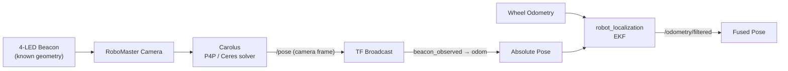

# Carolus / RoboMaster S1

Vision-based relative navigation on a rooted DJI RoboMaster S1 ground robot,
built around **Carolus/UVGS-2** — a monocular, 4-LED-beacon detection and P4P
(Perspective-4-Point) pose solver derived from NASA's SVGS system, originally
developed for the Astrobee free-flyer. A beacon of known geometry gives the
robot an absolute 6-DOF pose whenever it is in view; that pose is fused with
wheel odometry through a lightweight EKF (`robot_localization`), as a step
toward replacing the GPS channel of the MINS multi-sensor navigation
framework for indoor, GPS-denied relocalization.



On top of the perception pipeline, an autonomous state machine (SEARCH →
ALIGN → APPROACH → STOP) drives the robot to the beacon under visual
servoing, validated end to end on hardware. See
[`overleaf/technical.pdf`](overleaf/technical.pdf) below for the full setup
and reproduction guide.

## License

Apache License 2.0 — see [`LICENSE`](LICENSE) and [`NOTICE`](NOTICE).

This matches what the third-party components already declared rather than
overriding them: `carolus_ws/src/ff_msgs/` is NASA Astrobee code (Apache-2.0) and
`carolus_ws/src/libuvgs_astrobee/` (Carolus/uVGS-2, original author zauberflote1)
declares Apache-2.0 in its own `package.xml`. `NOTICE` lists each component,
its origin, and what was modified here.


## Versioning

Per the project's supervisor request (branches for the useful part of the
inherited code, then new versions/changes on top):

- **Branch `quentin-legacy`** (tag `v0`) — the inherited baseline:
  `libuvgs_astrobee` (the P4P/beacon detection core), `ff_msgs` (Astrobee
  message definitions, a build dependency of the inherited code), and the
  original top-level `launch/`/`moveuvgs.cc`/`dockerROS1`. History preserved
  from the original repository (29 commits).
- **Branch `nawfel-legacy`** (tag `v1` at the current tip, and the
  repository's default branch) — this stage's
  contribution on top of the legacy branch: `carolus_node` (TF broadcasting,
  `robot_localization` EKF integration, absolute pose from beacon
  detection), `robomaster_cam` (RoboMaster S1 SDK bridge,
  LOCATE/SEARCH/ALIGN/APPROACH state machine), `cmake_shims` (local build
  fixes for ROS Noetic on Ubuntu 22.04), `shortcuts` (the Tkinter launcher
  GUI and operational scripts), and `overleaf/` (report). `libuvgs_astrobee`
  also received one targeted update on `main`: recalibrated camera
  intrinsics in `carolus_astrobee.cpp` for the actual mounted camera.

## Building

Requires ROS Noetic. `catkin_make` from `carolus_ws/` — **not** `catkin
build`: this workspace has an existing `catkin_make` build space and the two
tools conflict.

**Not included in this repository** (install separately, standard upstream
packages, unmodified):
- [`robot_localization`](https://github.com/cra-ros-pkg/robot_localization),
  branch `noetic-devel`, commit `9ef26a57f` — the loosely-coupled EKF used by
  `carolus_node`. Left out to keep this repository to the code actually
  written/modified for this project (the upstream clone alone is ~36 MB).

See `shortcuts/README.md` for the operational scripts (launcher, deployment,
leak scan) and `cmake_shims/` for the Ubuntu 22.04 build workarounds (no
`sudo` required).

## Running Carolus under ROS2

The detection and solver code is also **middleware-agnostic**, not just
robot-agnostic. `libuvgs_astrobee` builds two targets: `carolus_core`, a
static library holding the algorithm (blob detection, target sort, Ceres P4P
solve, pose filter) and linking OpenCV/Eigen/Ceres and *nothing else*; and
`carolus_astrobee`, the ROS1 node that wraps it. The split is verified, not
asserted — the compiled library has an empty `NEEDED` list and zero
unresolved ROS symbols, checked on x86_64 and on the Raspberry Pi's aarch64.

[`raspberry5-carolus-ros2/`](raspberry5-carolus-ros2/) builds the same
sources under ROS2 as the test of that claim. It is deliberately
self-contained — its own manual, its own copy of the core — so it can be
handed over and built on its own. See its
[README](raspberry5-carolus-ros2/README.md).

Verified: the same detection/solver sources build under ROS Noetic, ROS2
Humble and ROS2 Jazzy, and the ROS2 wrapper detects a real beacon and
publishes a pose. Pose *accuracy* under ROS2 is not yet validated — the
solver reports `converged=0` and the ROS2 manual says so where a reader
will see it.

## Running Carolus on a different robot

Carolus itself is **robot-agnostic**: the detection and P4P solver
(`carolus_ws/src/libuvgs_astrobee/`) contain no reference to DJI, RoboMaster or RNDIS.
It takes a camera image on a ROS topic and publishes a pose. Everything
specific to one robot lives in a YAML profile, not in the source.

To run it on other hardware, you need three things — none of which requires
editing any code:

1. **Calibrate your camera.** You need `fx`, `fy`, `cx`, `cy` and the
   plumb_bob distortion coefficients. The MATLAB Camera Calibration Toolbox
   procedure is documented in `overleaf/technical.pdf` (calibration chapter),
   along with a Kalibr alternative.

2. **Measure your beacon.** Four LED positions in metres, in Carolus's
   left-handed frame, with **one point deliberately off the plane of the
   other three** — P4P needs that to resolve pose unambiguously.

3. **Write your profile.** Copy `carolus_ws/src/carolus_node/config/robomaster_s1.yaml`,
   substitute your values, and launch:

```bash
roslaunch carolus_node carolus.launch \
    config:=$(rospack find carolus_node)/config/my_robot.yaml \
    camera_topic:=/my/camera/image_raw
```

On Ubuntu 20.04 (including a Raspberry Pi), also pass
`ubuntu2204_preload:=false` — the `LD_PRELOAD` workaround it controls is
only needed on 22.04, which is not an officially supported ROS Noetic
target.

The `robomaster_cam/` package is the DJI SDK bridge for this specific robot
and is **not** needed on other hardware — supply the camera stream however
your platform already does, and point `camera_topic` at it.

`testcarolus.launch` remains the RoboMaster S1 entry point: it loads the S1
profile and adds an S1-specific static transform, then delegates to
`carolus.launch`.

## Testing

Full step-by-step reproduction guide, from a fresh Pi and a fresh S1 through
to a running Carolus pipeline: **[`overleaf/technical.pdf`](overleaf/technical.pdf)**,
in this repository. It is self-contained — powering on, rooting the S1,
Raspberry Pi and ROS setup, RNDIS networking, the camera bridge, camera
calibration, and building/launching Carolus, including how to run it on a
robot other than this one.

Prerequisite for every session: robot powered on (double chime), Pi
reachable at its RNDIS/Wi-Fi address, `eth1` interface up on the Pi with an
address on the robot's subnet.

Launching the stack:

```bash
python3 shortcuts/carolus_launcher.py
```

Then, in order, the launcher's 5 buttons:

| Button | What runs | Unlocked when |
|---|---|---|
| 1 · roscore + Pi | SSH → `eth1 up` + `roscore` | port 11311 open |
| 2 · Camera + Beacon | SSH → `rm_cam_beacon.py` + `cam_view_helper.py` | `/camera/color/image_raw` published |
| 3 · Carolus Astrobee | `roslaunch carolus_node testcarolus.launch` | manual |
| 4 · TF Broadcaster (quat fix) | SSH → `carolus_tf_broadcaster.py` on the Pi | manual |
| 5 · MINS (simulation, Pi) | SSH → MINS's own `simulation.launch` in `~/mins_sandbox_ws` | always (independent of the pipeline above) |

**Sanity check that the pipeline is actually working**: with the terminals
running and an LED beacon in the camera's field of view, `rostopic hz /pose`
should report a steady rate. With Carolus running on the Raspberry Pi that is
roughly 13 Hz; running it on the lab PC instead drops this to roughly
2.2 Hz, because every uncompressed 1280x720 frame has to cross the network
first — see the technical manual for why the Pi is the right target.
`rostopic echo /pose` should show
a `geometry_msgs/PoseStamped` with a plausible Z distance matching the
beacon's real distance from the camera. In the launcher GUI, the
`BEACON: DETECTED` indicator should light up.

**Known non-blocking warnings** you'll see on a normal launch, none worth
re-diagnosing: a missing
`~/catkin_ws/devel/setup.bash` line in the lab PC's `.bashrc` (leftover from
a previous setup), a ROS log-directory-over-1GB warning on the Pi, and a
`pillow`/`imageio` version mismatch from the `myqr` dependency (unused in
this RNDIS-based pipeline).

## Report

`overleaf/` holds **`technical.pdf` / `technical.tex`** — the self-contained
technical manual (power-on through building and launching Carolus). This is
the one to read to set the system up; compile `technical.tex` on Overleaf or
locally with `pdflatex` (two passes).

`raspberry5-carolus-ros2/technical-ros2.tex` is a **second, separate manual**
covering the ROS2 port on the lab PC and a Raspberry Pi 5. It is independent
of the one above rather than a chapter of it, so the ROS2 folder stays
portable on its own.

---

<details>
<summary><h2 style="display:inline">Legacy notes (original inherited README, `v0`)</h2></summary>

```
# p4p-zbft
P4P Solver on Manifolds by ZBFT

## CHANGES
- CLEAN UP OF OLD METHODS, EXTRA VARS, AND BLOB WINDOW
- ADD QUEUE SIZE, CONTROL IMAGE FREQUENCY FOR PROCESSING
- USES CONDITIONAL VARIABLE (NOTIFY_ONE()) TO NOTIFY PROCESS IMAGE THREAD
- PROCESS IMAGE THREAD RUNS UNTIL QUEUE IS EMPTY
- SUPPORTS BAYER IMAGES
- CPU REDUCTION DONE
- FISHEYE MODEL
- MONO IMAGES SEPARATE PIPELINE
- TENTATIVE ASTROBEE PREPROCESSING
- FOV MODEL
- ADD EQUIVALENCY TO ASTROBEE COORDINATE FRAME

## TODO NEAR FUTURE

- HANDLE CASE WITH MULTIPLE TARGETS IN VIEW
- PUBLISH MSGS AS MARKER TRACKING

@1822 TROPICAL EMPIRE -- ZBFT
```

</details>
