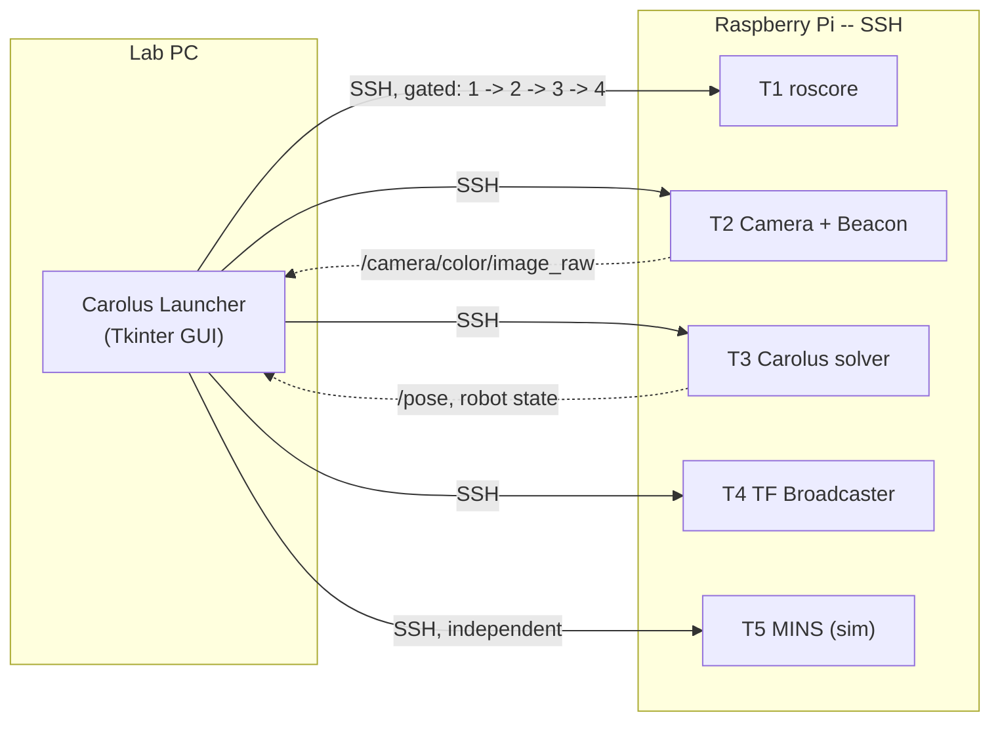

# Carolus Launcher

<!-- SCREENSHOT 1 (hero): full GUI mid-session -- robot on, beacon detected,
     dashboard showing a live state (SEARCH/ALIGN/APPROACH), at least 2-3 log
     tabs with real scrollback. This is the one image that has to sell it. -->

Turn the robot on, run one script, and every terminal, control, and status
indicator needed to fly it lives in one window.

## Why it exists

Running Carolus by hand means five SSH sessions to the Pi, launched in a
specific order, each one silently assuming the last one actually worked.
Carolus Launcher replaces that with one sequenced console: each stage
unlocks only once the previous one is *confirmed* running — not assumed —
and the whole session is visible and logged from a single window on the lab
PC.

## What it does

- **Sequenced, gated launch.** Five stages — `roscore`, camera + beacon
  detection, the Carolus solver, the TF broadcaster, MINS — each button
  stays locked until the previous stage proves itself: port 11311 open,
  `/camera/color/image_raw` actually publishing, and so on. A stage that
  looks fine but isn't cannot be launched past by accident.
- **Live piloting.** ZQSD + numpad, MANUAL mode only, by design — the robot
  never moves on its own.
- **Live state dashboard**, parsed straight out of the robot's own log
  stream: SEARCH / ALIGN / APPROACH / STOP.
- **One log tab per process**, each also mirrored to a timestamped session
  log on disk (`shortcuts/logs/session-*.log`), so a specific terminal's
  output can be grepped back after the fact.
- **Live camera preview and blob-detection view** — the same detection
  overlay that used to need a manually configured rviz panel, now a
  thumbnail in the launcher.

  <!-- SCREENSHOT 2 (optional): tight crop on the blob-detection view --
       coloured circles on the beacon's 4 detected LEDs. Visually the most
       distinctive single panel; worth its own close-up if there's a good
       frame. -->

- **Pi health at a glance** — temperature, load, RAM, so a session doesn't
  end with "it was probably the Pi" as an unfalsifiable guess.

## Design decisions worth knowing about

- **MANUAL-only is the default, and stayed the default even when an AUTO
  mode existed.** It was removed outright once real use showed it was never
  actually used — MANUAL is also the one mode where the robot cannot move
  without an operator's hand on the key.
- **Unused features were deleted, not left to rot.** LOCATE, wheel-tilt
  telemetry, the beacon mini-map, and the whole docking tab were stripped in
  a single pass once it was clear nobody was using them — net −211 lines,
  logged as a deliberate cut rather than silently accumulating dead UI.
- **ZQSD, not WASD.** Everything else in the GUI was translated to English
  for handover; the piloting keys were not, because they are the physical
  keys on this AZERTY setup. Translating them would have made the labels
  more consistent and the controls wrong.

## Under the hood

Single-file Tkinter application, ~1,900 lines, orchestrating five processes
across two machines over SSH from one process-management layer, with
structured per-tab logging and live topic parsing for the dashboard. No
external GUI framework, no build step — `python3 shortcuts/carolus_launcher.py`
and it runs.

Full technical reference — every parameter, every panel, the complete
change history — lives in
[`shortcuts/README.md`](../shortcuts/README.md#carolus_launcherpy).
For how to actually run a session, see the main
[README's Testing section](../README.md#testing).
