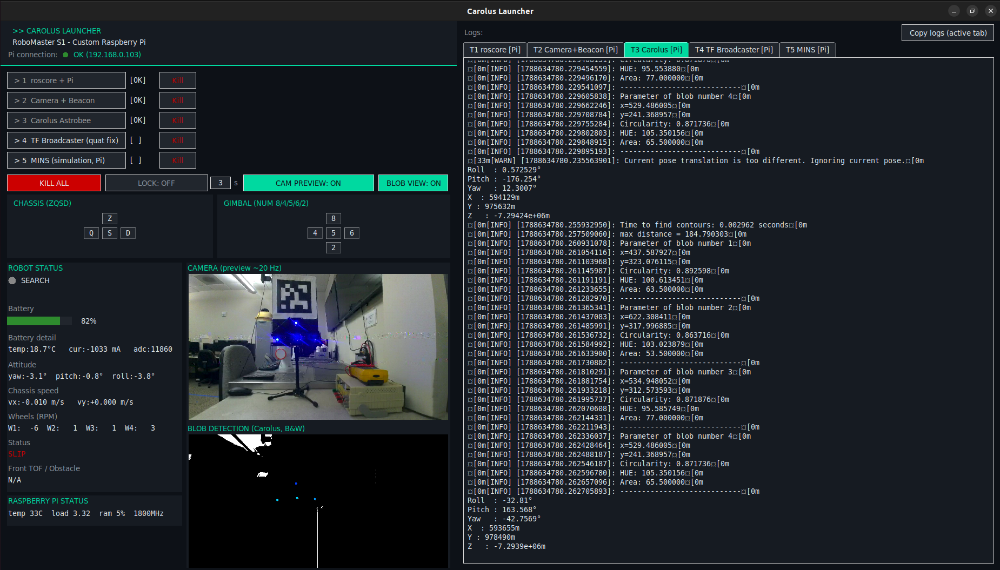
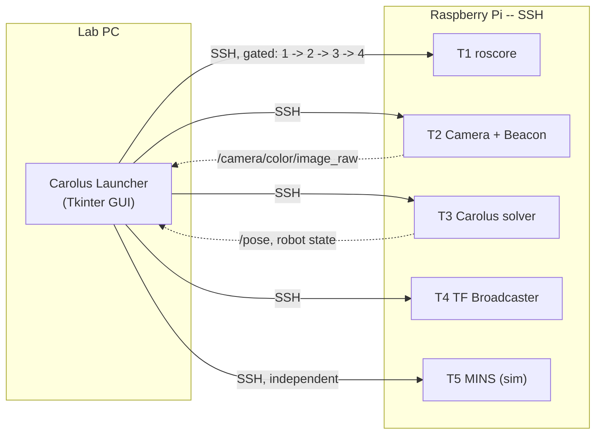
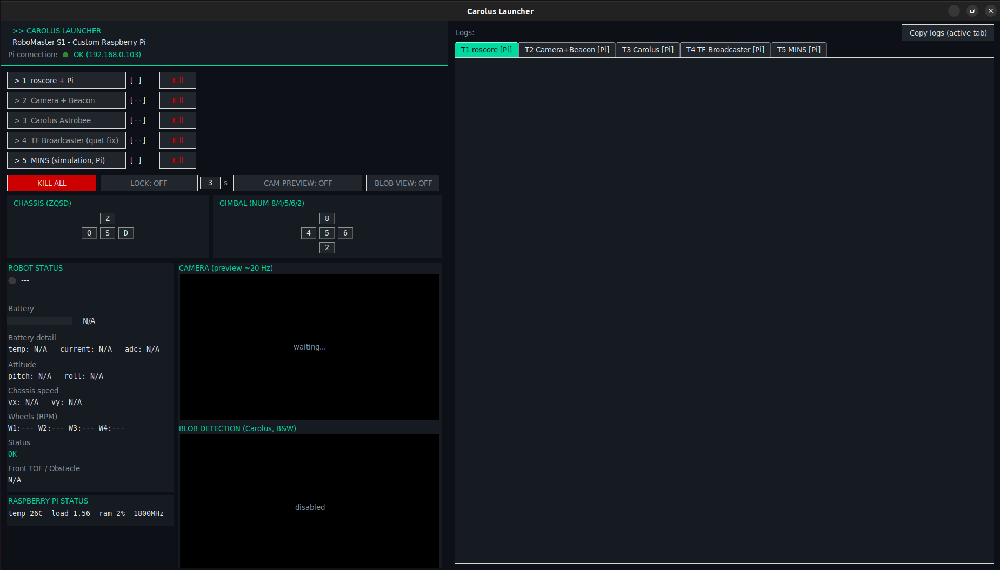
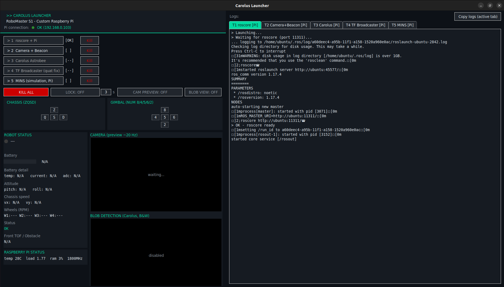
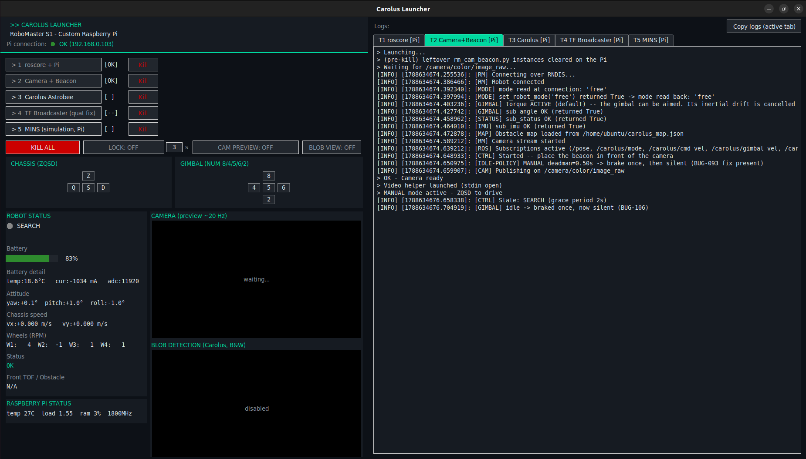
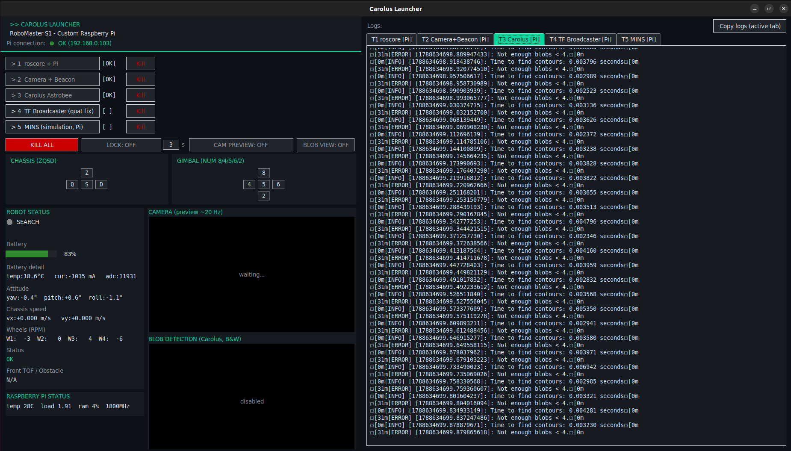
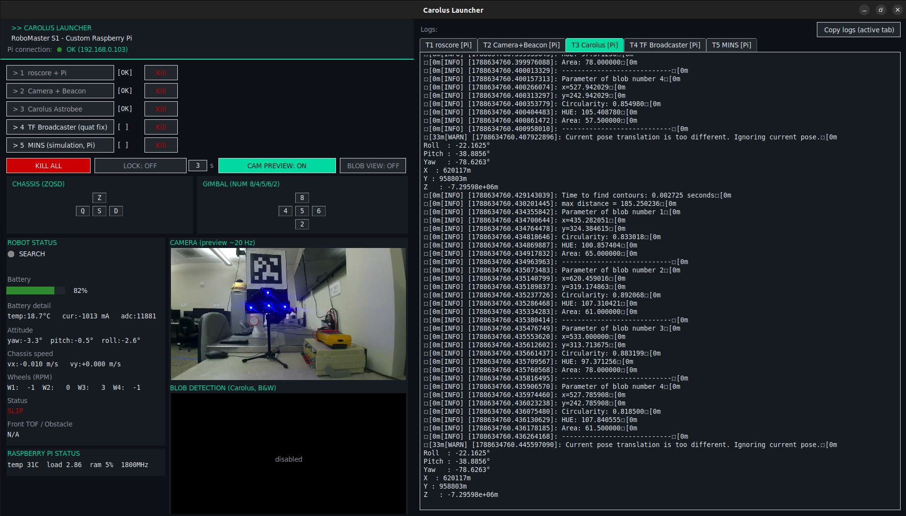
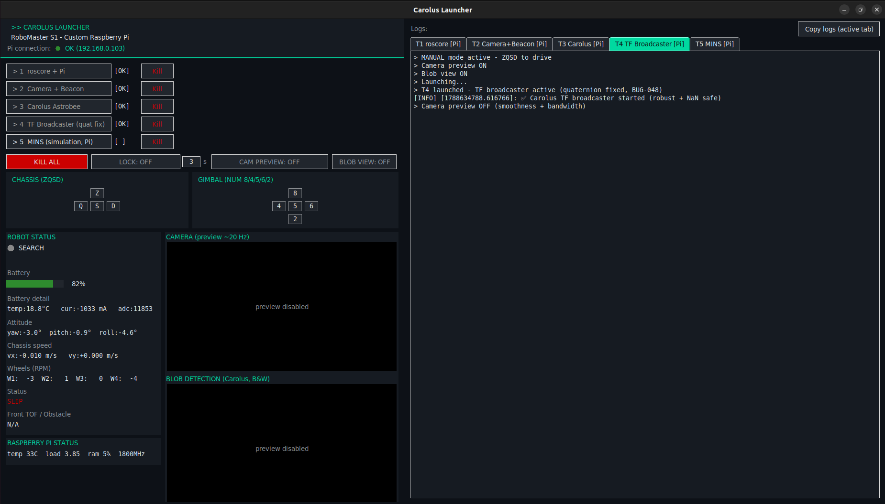
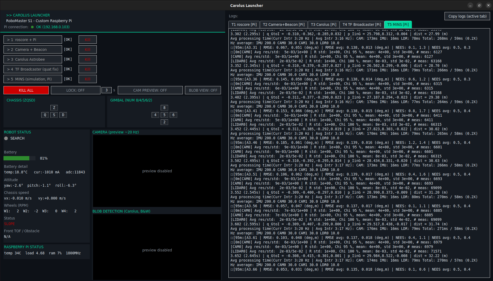

# Carolus Launcher

Turn the robot on, run one script, and every terminal, control, and status
indicator needed to fly it lives in one window.

## Why it exists

Running Carolus by hand means five SSH sessions to the Pi, launched in a
specific order, each one silently assuming the last one actually worked.
Carolus Launcher replaces that with one sequenced console: each stage
unlocks only once the previous one is *confirmed* running — not assumed —
and the whole session is visible and logged from a single window on the lab
PC.

## What it does

- **Sequenced, gated launch.** Five stages — `roscore`, camera + beacon
  detection, the Carolus solver, the TF broadcaster, MINS — each button
  stays locked until the previous stage proves itself: port 11311 open,
  `/camera/color/image_raw` actually publishing, and so on. A stage that
  looks fine but isn't cannot be launched past by accident.
- **Live piloting.** ZQSD + numpad, MANUAL mode only, by design — the robot
  never moves on its own.
- **Live state dashboard**, parsed straight out of the robot's own log
  stream: SEARCH / ALIGN / APPROACH / STOP.
- **One log tab per process**, each also mirrored to a timestamped session
  log on disk (`shortcuts/logs/session-*.log`), so a specific terminal's
  output can be grepped back after the fact.
- **Live camera preview and blob-detection view** — the same detection
  overlay that used to need a manually configured rviz panel, now a
  thumbnail in the launcher, visible together in the screenshot above.
- **Pi health at a glance** — temperature, load, RAM, so a session doesn't
  end with "it was probably the Pi" as an unfalsifiable guess.

## A real launch sequence, step by step

Eight screenshots from one actual session (2026-09-05), each one the moment
a stage came up. Nothing staged for the camera — this is what a normal
session's log tabs actually say.

**1 — idle.** Nothing launched yet: every stage but T1 shows `[--]`, no log
in any tab.

**2 — `roscore` comes up.** T1's own log, unedited:
`started roslaunch server http://ubuntu:45577/`, then
`ROS_MASTER_URI=http://ubuntu:11311/`, `started core service [/rosout]`.

**3 — the SDK connects.** T2 gated on `/camera/color/image_raw` actually
publishing, not just the process starting: `[RM] Connecting over RNDIS...`,
`[MODE] set_robot_mode('free') returned True -> mode read back: 'free'`,
`[GIMBAL] torque ACTIVE`, three separate subscription confirmations
(`sub_angle`, `sub_status`, `sub_imu`, each `OK (returned True)`), then
`[CAM] Publishing on /camera/color/image_raw` and `OK - Camera ready`.

**4 — running, nothing to see yet.** T3 is up and solving, but no beacon is
in frame: a clean, repeating `Time to find contours: 0.003s` /
`Not enough blobs < 4.` pair, frame after frame. This is the correct,
honest behaviour with an empty scene — not an error state.

**5 — a target enters the frame.** `CAM PREVIEW` toggled on: the live feed
picks up a real target on the far wall, and the solver starts reporting
per-blob parameters (`x`, `y`, `Circularity`, `HUE`, `Area`) instead of the
"not enough blobs" line above.

**6 — camera and blob view together.** Both preview panels on at once — the
raw feed and Carolus's own black-and-white detection output, side by side.
This is the shot at the top of this page.

**7 — the TF broadcaster joins.** T4 unlocked and launched:
`T4 launched - TF broadcaster active (quaternion fixed, BUG-048)`,
`Carolus TF broadcaster started (robust + NaN safe)`.

**8 — the full pipeline, MINS included.** All five stages read `[OK]`. T5's
own tab is a live multi-sensor estimator, not a mock: real RMSE/NEES figures
and per-sensor Hz averages (`IMU 200.0 CAM0 30.0 CAM1 30.0 LDR0 10.0`)
scrolling in real time.

## Design decisions worth knowing about

- **MANUAL-only is the default, and stayed the default even when an AUTO
  mode existed.** It was removed outright once real use showed it was never
  actually used — MANUAL is also the one mode where the robot cannot move
  without an operator's hand on the key.
- **Unused features were deleted, not left to rot.** LOCATE, wheel-tilt
  telemetry, the beacon mini-map, and the whole docking tab were stripped in
  a single pass once it was clear nobody was using them — net −211 lines,
  logged as a deliberate cut rather than silently accumulating dead UI.
- **ZQSD, not WASD.** Everything else in the GUI was translated to English
  for handover; the piloting keys were not, because they are the physical
  keys on this AZERTY setup. Translating them would have made the labels
  more consistent and the controls wrong.

## Under the hood

Single-file Tkinter application, ~1,900 lines, orchestrating five processes
across two machines over SSH from one process-management layer, with
structured per-tab logging and live topic parsing for the dashboard. No
external GUI framework, no build step — `python3 shortcuts/carolus_launcher.py`
and it runs.

Full technical reference — every parameter, every panel, the complete
change history — lives in
[`shortcuts/README.md`](../shortcuts/README.md#carolus_launcherpy).
For how to actually run a session, see the main
[README's Testing section](../README.md#testing).
